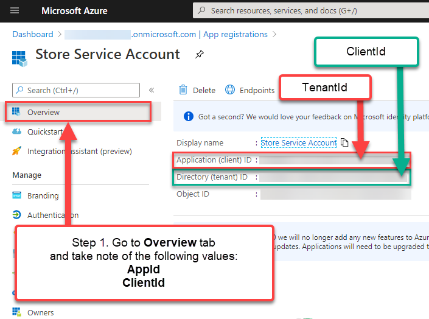
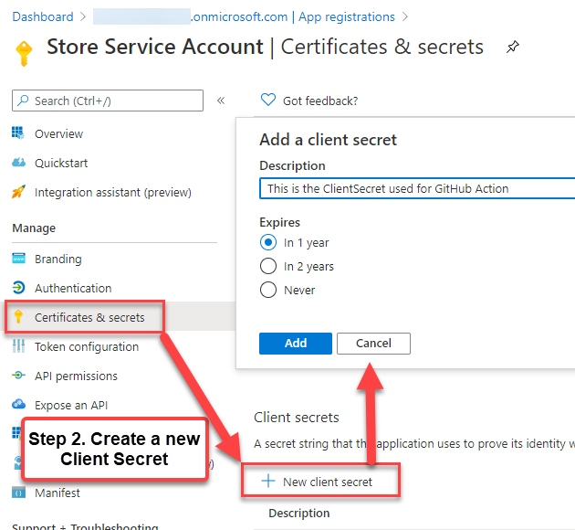
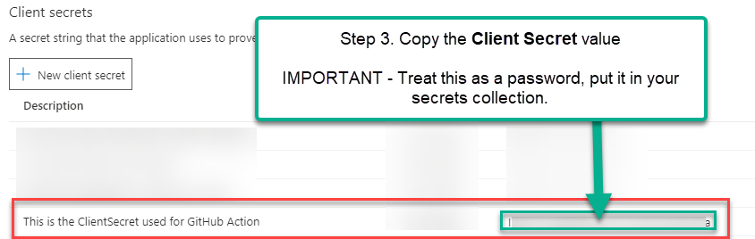
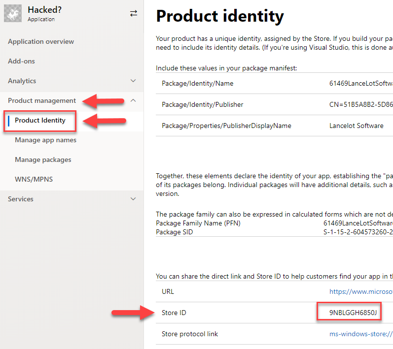

# Microsoft Partner Center Broker

A library that lets you use the Microsoft Partner Center DevCenter APIs to manage your UWP application submissions. application submissions.

Documentation

* [Home](./docs/index.html) 
* API Reference
  * [DevCenter Class](./docs/classes/_index_.devcenter.html)
  * [Interfaces](./docs/modules/_interfaces_.html)
  * [Converters](./docs/modules/_converters_.html)
  
## Usage

You will need the following 4 pieces of information to use this:

* A Service Principal's **Tenant ID**, **Client ID** and **Client Secret** (if you do not have this already, see the Authentication or  section below)
* Your app's **App ID** (aka 'Store ID' in DevCenter). If youdo not know this, see the Screenshots section below.

If you do not have any of the above, see the **Quick-Start by Screenshots** section below.

### Code

Once you have your Tenant ID, Client ID and client Secret, you can initialize the DevCenter object

```typescript
import { DevCenter } from '@LanceMcCarthy/partner-center-broker'

const appId = "";
const tenantId = "";
const clientId = "";
const clientSecret = "";

// Instantiate a DevCenter object
const devCenter = new storeSdk.DevCenter(tenantId, clientId, clientSecret);
```

#### Methods

Currently there are several methods:

```typescript

// To get an application's information (returns type of AppResourceResult)
const appInfo = await devCenter.GetAppInfo(appId);

// To create a submission (returns type of CommitSubmissionResult). See 'Upload Assets' code example for more information about how to use this result.
const createSubmissionResult = await devCenter.CreateAppSubmission(appId);

// Grab the submission ID for use in the rest of the workflow
const submissionId = createSubmissionResult.Id;

// Get a existing application's submission information (returns type of GetSubmissionResult)
const getSubmissionResult = await devCenter.GetSubmission(appId, submissionId);

// Commit a submission for review (returns type of AppResourceResult)
const commitSubmissionResult = await devCenter.CommitSubmission(appId, submissionId);

// Delete a submission (returns type of boolean)
const getSubmissionStatusResult = await devCenter.DeleteSubmission(appId, submissionId);
```

### Uploading assets

When you start a submission, you get an SAS storage URL in the `CommitSubmissionResult`. That is the location you need to upload the application's packages and data.

Here's is an easy way to use Azure Storage package to do that:

```typescript
// Import the Azure BlobStorage SDK
import { BlockBlobClient } from '@azure/storage-blob'

// After you start the submission, it returns an SAS url in the result.
const startSubmissionResult = await devCenter.CreateAppSubmission(appId);

// the pre-authenticated SAS url can be used to create a client
const blobClient = await new BlockBlobClient(startSubmissionResult.fileUploadUrl);

// Upload the packages and data
await blobClient.uploadFile(packageFile);

```

## Authentication

For a more robust explanation of how to create this information, visit the Microsoft Store Broker documentation's [Authentication section](https://github.com/microsoft/StoreBroker/blob/master/Documentation/SETUP.md#authentication). For your convenience, I have copied and modified that info to streamline it.

You need three key pieces of information from Azure portal:

* `TenantId`: This is the ID of the Azure Active Directory (AAD) connected to your developer account.
* `ClientId` and `ClientSecret`: Essentially a username/password for a "user" that you create for StoreBroker to be able to use the API against your developer account on your behalf.

> You only need to perform this task once, the credentials can be reused for every run. **Protect the `Client ID` and `Client Secret` as if they were your username and password**.

To get those values:

1. In Dev Center, go to your **Account settings**, click **Manage users**, and associate your
   organization's Dev Center account with your organization's AAD. For detailed instructions,
   see [Manage account users](https://msdn.microsoft.com/windows/uwp/publish/manage-account-users).

2. In the **Manage users** page, click **Add Azure AD applications**, add the Azure AD application
   that represents the app or service that you will use to access submissions for your Dev Center
   account, and assign it the **Manager** role. If this application already exists in your AAD,
   you can select it on the **Add Azure AD applications** page to add it to your Dev Center account.
   Otherwise, you can create a new AAD application on the **Add Azure AD applications** page.
   For more information, see [Add and manage Azure AD applications](https://msdn.microsoft.com/windows/uwp/publish/manage-account-users#add-and-manage-azure-ad-applications). 

3. Return to the **Manage users** page, click the name of your Azure AD application to go to the
   application settings, and copy the **Tenant ID** and **Client ID** values.

4. Click **Add new key**. On the following screen, copy the **Key** value, which corresponds to the
   **Client secret**. You *will not* be able to access this info again after you leave this page,
   so make sure to not lose it. For more information, see the information about managing keys in
   [Add and manage Azure AD applications](https://msdn.microsoft.com/windows/uwp/publish/manage-account-users#add-and-manage-azure-ad-applications).

> These steps are directly from the Partner Center [API Documentation](https://msdn.microsoft.com/windows/uwp/monetize/create-and-manage-submissions-using-windows-store-services).

## Quick-Start by Screenshots

### Getting Service Principal Credentials from Azure Portal

#### Step 1



#### Step 2



#### Step 3



## Getting the App ID

Go to Microsoft [Partner Center Developer Dashboard](https://partner.microsoft.com/en-us/dashboard/windows/overview) and navigate to your app's page. Once there, open the *Product Management > Product Identity* pane.



## API Reference

See [API Reference Documentation](https://github.com/LanceMcCarthy/Action-MicrosoftPartnerCenter/docs)
